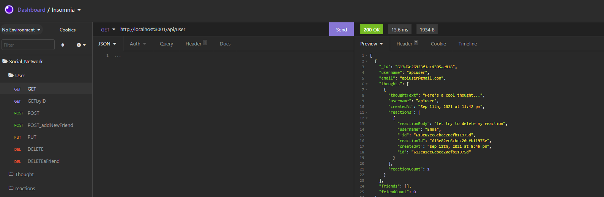
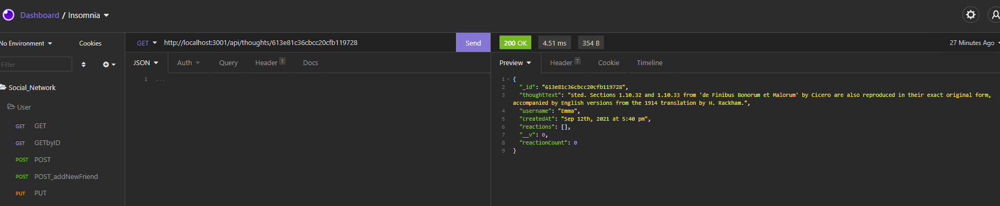

# Social Network

## Description

MongoDB is a popular choice for many social networks due to its speed with large amounts of data and flexibility with unstructured data. This challenge was to build an API for social network web application where users can share their thoughts, react to friends' thoughts, and create a friend list.

## Table of Contents

- [Installation](#installation)
- [Usage](#usage)
- [Credits](#credits)
- [License](#license)
- [Walkthrough](#walkthrough)
- [Screenshot](#screenshot)
- [Questions](#questions)

## Installation

- Clone the repository to your computer
- At the terminal type **npm install** to install the dependencies \*type npm i express (to install express.js)
- Type **npm i mongoose** (to install mongoose)
- Type **npm start** to start the server
- Go to localhost:3001 by using Insomnia Core (or your tool of choice)

## Usage

To get all users, get a userbyID, create/delete a user, add/remove friends, create/delete thought, get all/one thougth and create/delete reaction see below:

- Get all users: GET http://localhost:3001/api/user/
- Get one user: GET http://localhost:3001/api/user/:userid
- Create a user: POST http://localhost:3001/api/user/
- Update a user: PUT http://localhost:3001/api/user/:userid
- Delete a user: DELETE http://localhost:3001/api/user/:userid
- Add a friend: POST http://localhost:3001/api/user/:userid/friends/:userid_of_friend
- Delete a friend: DELETE http://localhost:3001/api/user/:userid/friends/:userid_of_friend
- Get all thoughts: GET http://localhost:3001/api/thoughts/
- Get one thought: GET http://localhost:3001/api/thoughts/:thoughtid
- Create a thought: POST http://localhost:3001/api/thoughts/
- Update a thought: PUT http://localhost:3001/api/thoughts/:thoughtid
- Delete a thought: DELETE http://localhost:3001/api/thoughts/:thoughtid
- Create a reaction: POST http://localhost:3001/api/thoughts/:thoughtid/reactions
- Delete a reaction: DELETE http://localhost:3001/api/thoughts/:thoughtid/reactions/:reactionid

## Credits

Denisse Rivera

## License

This application is covered by MIT License. For more information about the license please click [here](https://choosealicense.com/licenses/mit/)

## Walkthrough

A walkthrough video can be found [here](https://drive.google.com/file/d/1NRikwlPTxzUETeNjJeXoSred_9-p3qRd/view)

## Screenshot

- Get all users:

- Thought by Id

## Questions

For any questions, please contact me using the information below:

- Github Profile: [RiveraDenisse](https://github.com/RiveraDenisse)
- Email me at : denisse_alejandrar@hotmail.com
